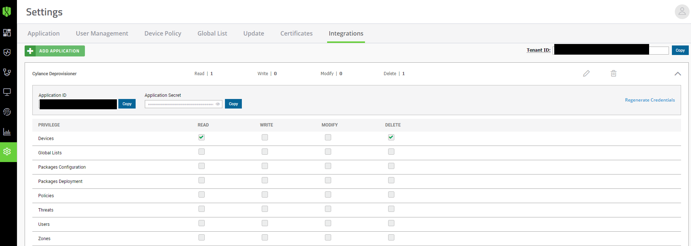
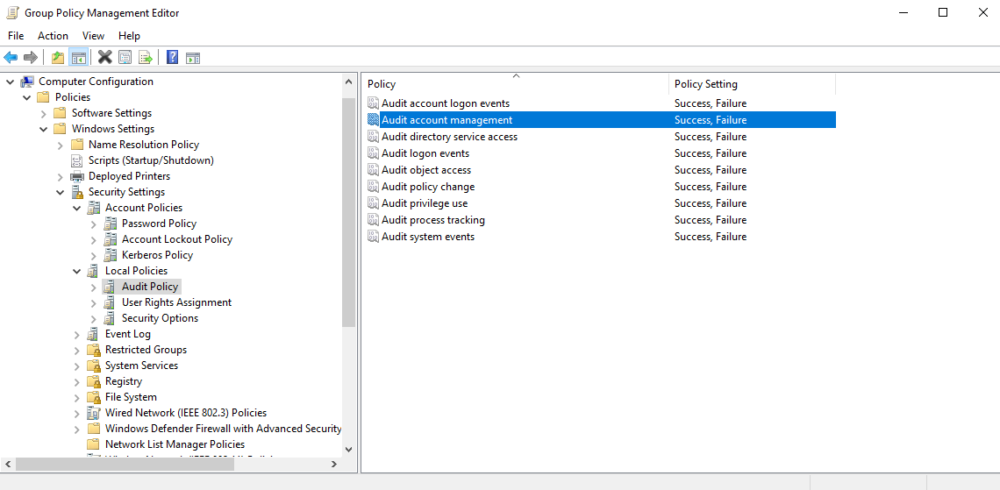
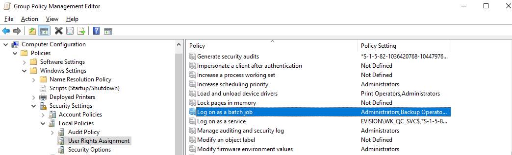

# CylanceDeprovisioner
Python script that will delete a computer from your Cylance tenant

## Installation
- Download Python 3 from https://www.python.org/downloads/
- `git clone https://github.com/gerwout/CylanceDeprovisioner.git`
- `cd CylanceDeprovisioner`
- install dependencies: `pip install -r requirements.txt`
- copy config.example.ini config.ini and edit the configuration

## Create executable
- Follow the above installation instructions
- `python setup.py build`

This will create an executable in the build directory

## Usage
`python cylance.py --config <path to config.ini> --system <hostname of system>`
The above command will delete the given hostname from the Cylance tenant. If it encounters 
an error it will send an email alert to the email address that is configured in the 
configuration file. It will also send an email when it finds multiple systems with the same 
hostname or if it can not find the given hostname. 

## Setup Cylance API key
You'll need to setup a Cylance API key. This can be done from within the Cylance web
console (i.e. Settings -> Integrations -> Add application). Setup an application with READ 
and DELETE privileges on the devices.

Add the Cylance tenantid, application id and application secret to config.ini

## Automate deletion with task scheduler
To be able to automatically remove a computer from Cylance once you delete that computer
 in active directory you have a couple of pre-requisites.

- Enable computer account management auditing using group policy

- Create a service user and using GPO give the "Log on as a batch job" user right

- Edit the taskscheduler-example.xml file (you can find it in the docs directory), you 
probably want to adjust the path where the Cylance deprovisioner can be found
- All your domain controllers should import the adjusted XML file, when you encounter 
problems, please set debug to True in config.ini for further troubleshooting.